# AllodsOnlineEditorTools
Allods Online editor tools for 1.1.02.0


# Setup

## Requirements

To correctly use these tools you'll need:

- Allods 1.1.02.0 server and client files
- Allods 1.1.02.0 extracted client files, that you can get with the unpacker (https://github.com/paulus-allods/AllodsOnlineDatabaseUnpacker)
- Allods 1.1.02.0 helper archive (https://community.allods-developers.eu/resources/v1-helper-folder.24/)

## Setup folders

- Create a folder with nested `bin`, `data` and `Editor` folder
- Copy the `data` folder from this repository in your `data` folder
- Copy the `Editor` folder from this repository in your `Editor` folder
- Copy `Release_bin` folder from Helper Archive to `bin` folder
- Copy all xdb from server `data` folder to your `data` folder
- Extract all `.pak` archives (you don't need System, Lua, Bin, Texts) from client and move all folders to your `data` folder
- Copy all xdb from the extracted database to your `data` folder


You should have the following folder architecture :

```
.
+-- bin
|   +-- All files from Release_bin
+-- data
|   +-- Characters
|   +-- Client
|   +-- Creatures
|   +-- Editor
|   +-- Interface
|   +-- ItemMall
|   +-- Items
|   +-- ...
+-- Editor
|   +-- CommonFolder
|   +-- ...
```

You can now start tools from your `bin` folder

# Tools

## Core Design

Start with `CoreDesign.bat`

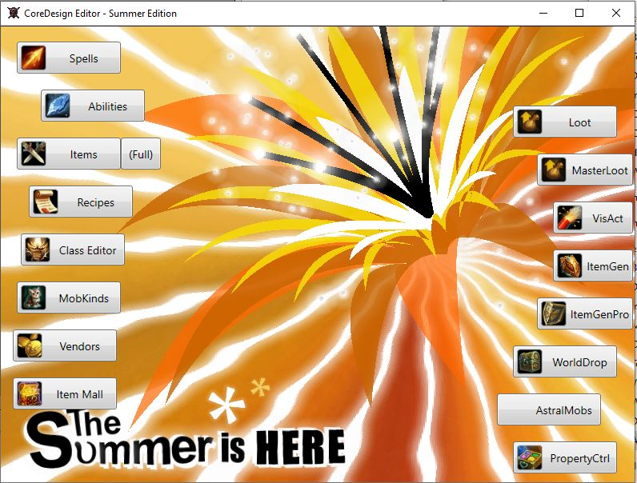

### Abilities

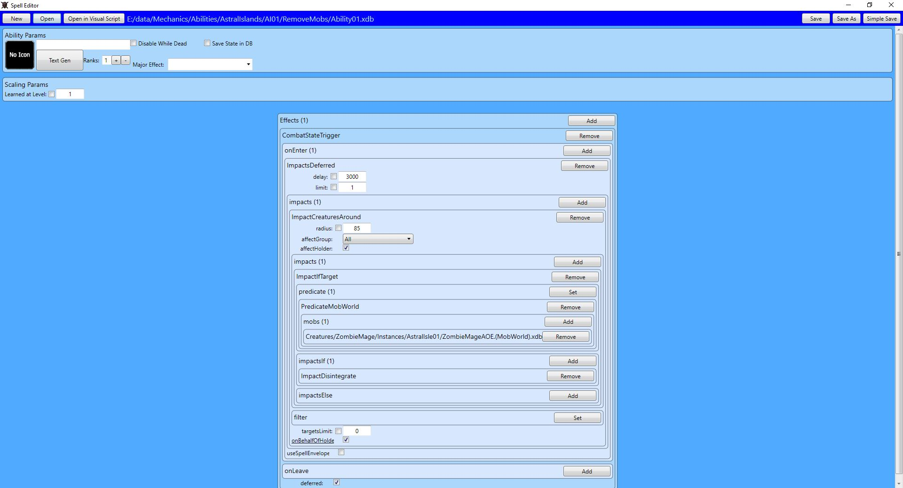

### Item Mall

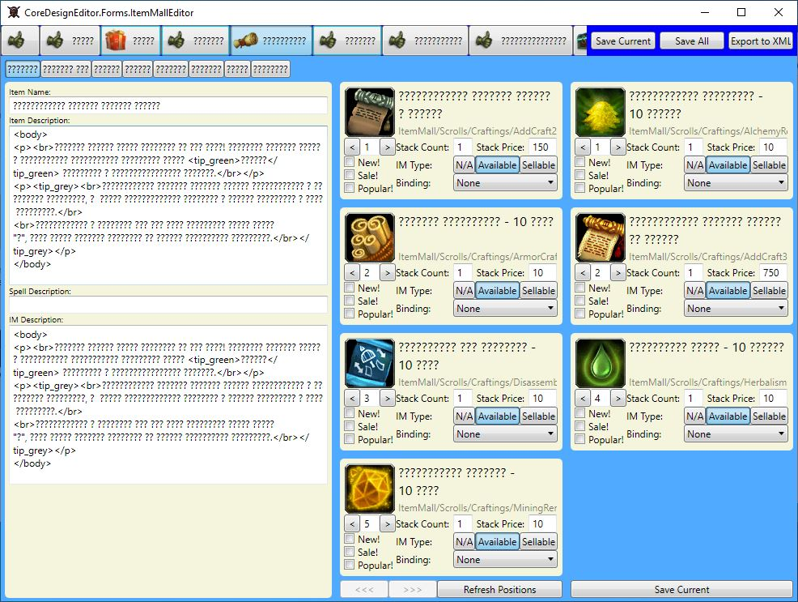

### Recipes

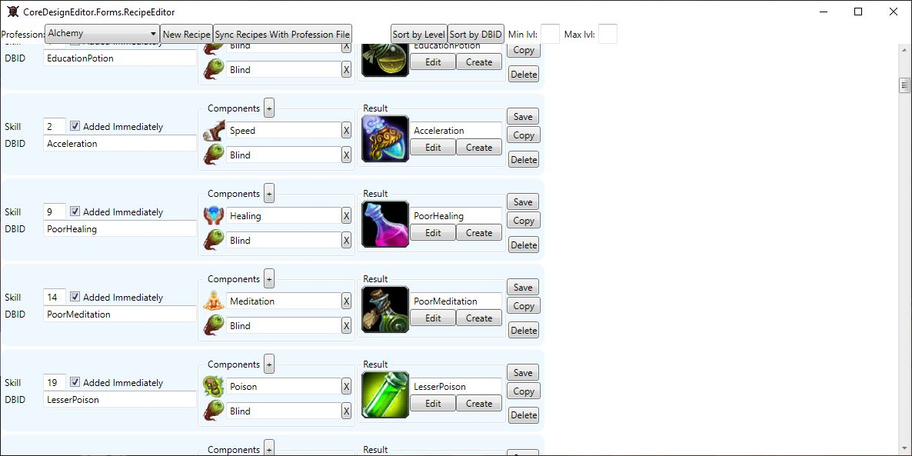

### Spell

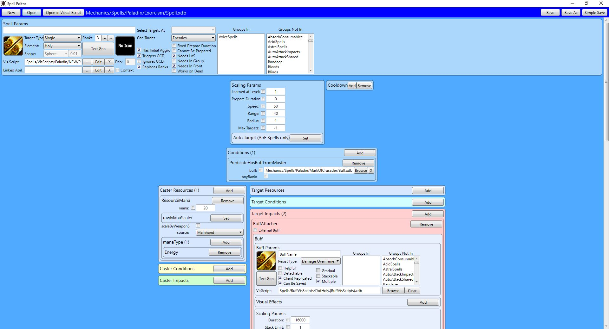

### Vendors

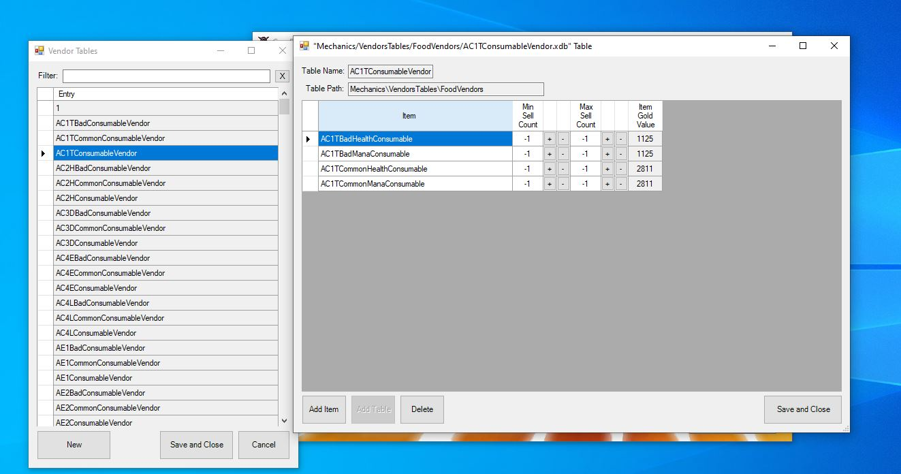

### Loot

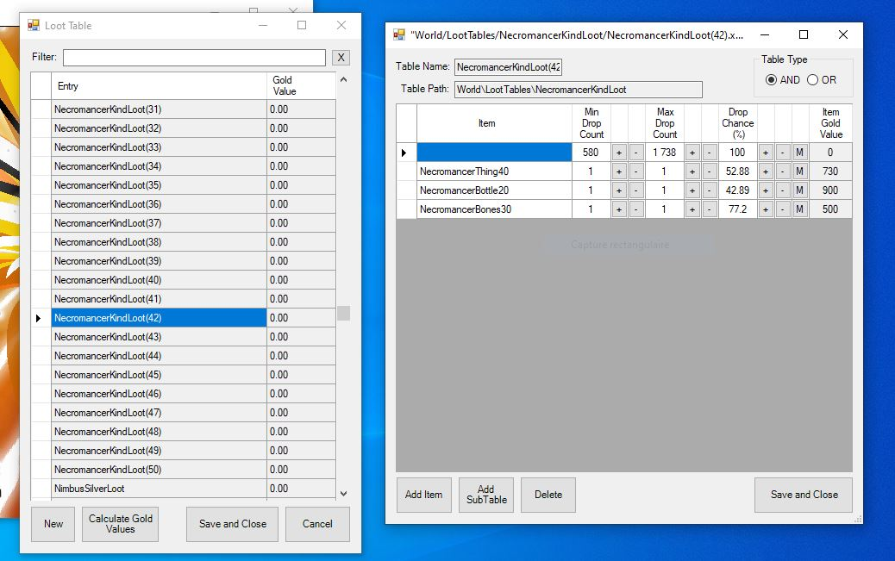

### VisScript

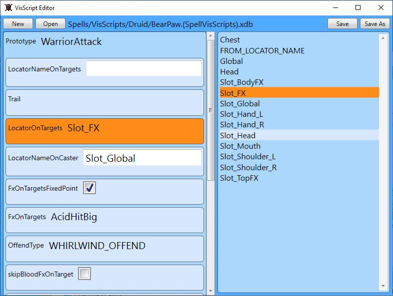

### Item Generator

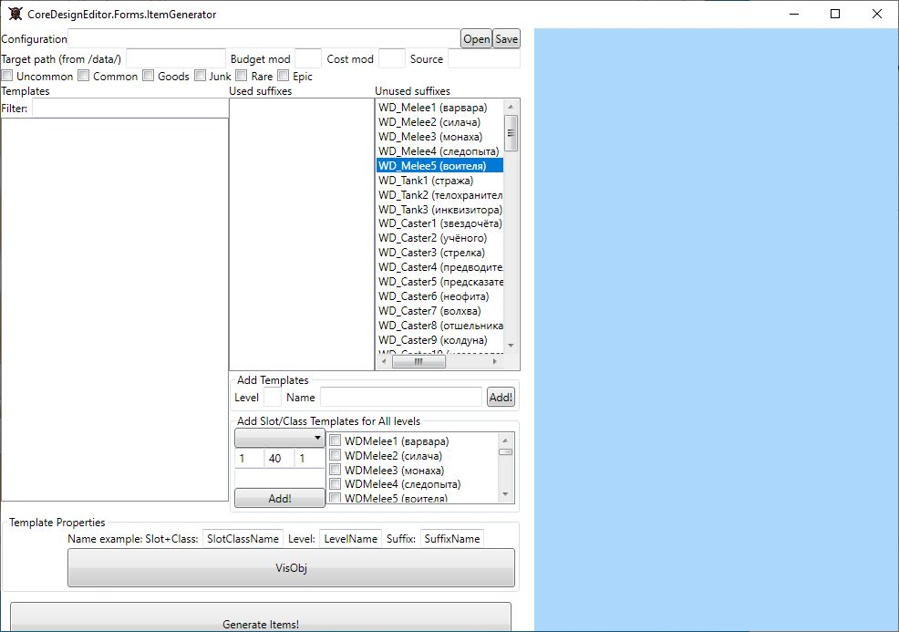

## EditorGui aka MapEditor

Start with `EditorGUI.exe`

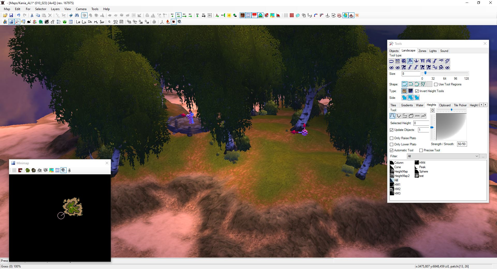

## MobEditor

Start with `EditorEditor.bat`

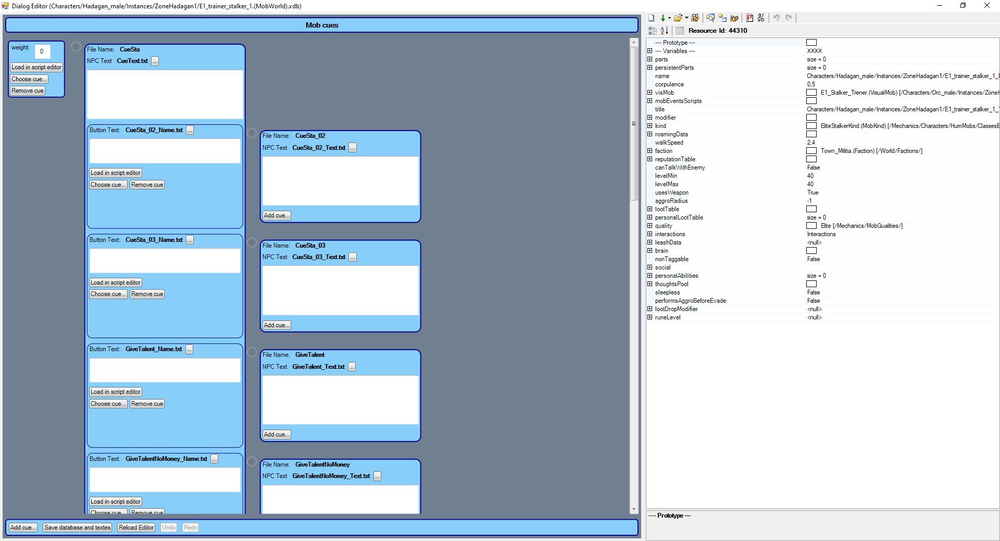

## ModelViewer

Start with `ModelViewer.bat`

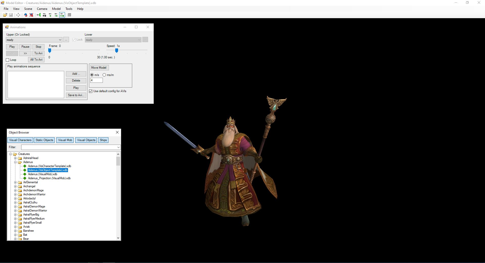

## Properties and WPFProperties

Start with `Properties.bat`

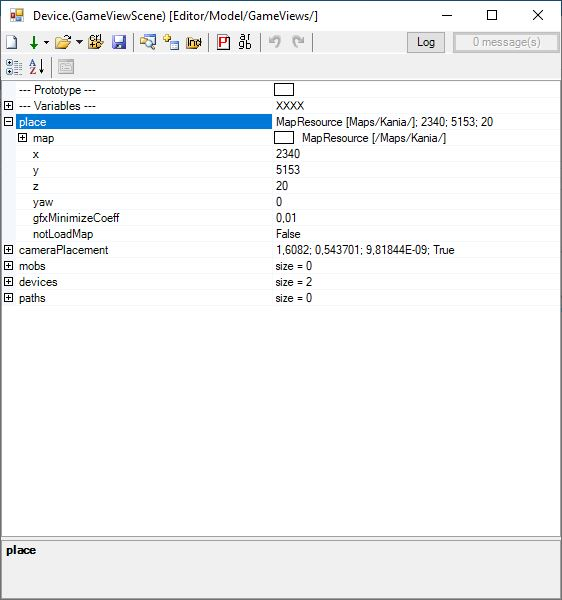

Start with `WPFProperties.bat`

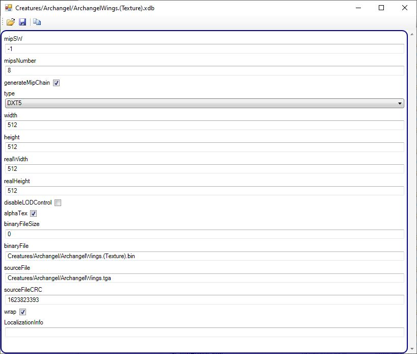

## Table Editor

Start with `TableEditor.bat`

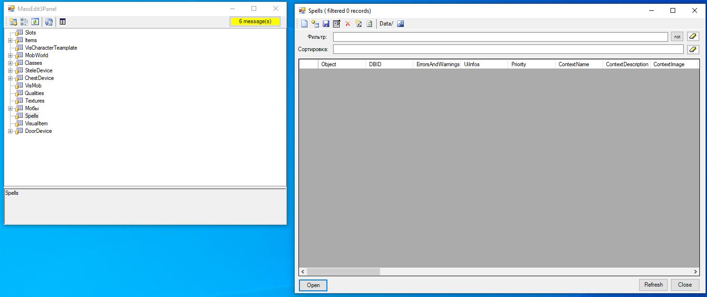

## The Browser

Start with `TheBrowser.bat`

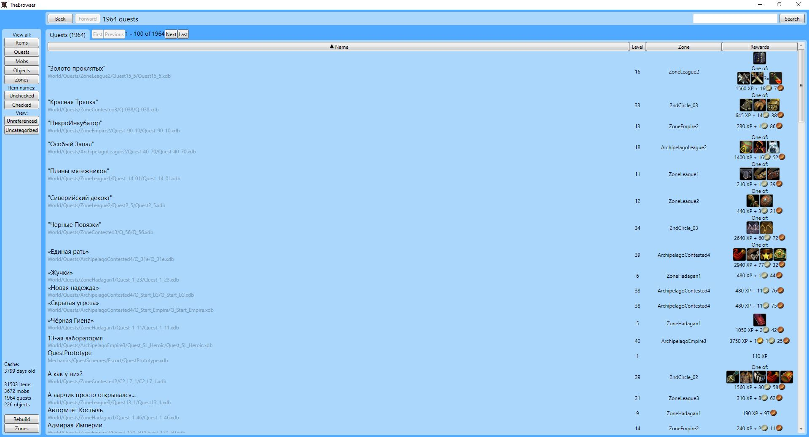

## UIEditor

Start with `UIEditor.bat`

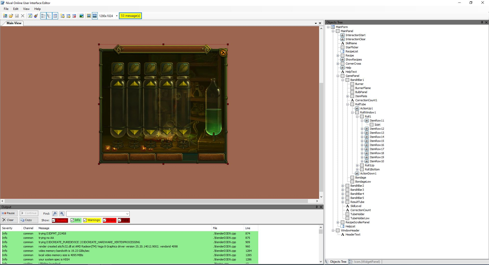
